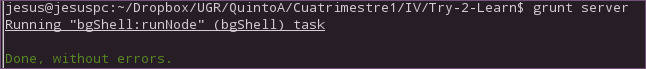

# Try-2-Learn
## Proyecto para la asignatura IV 2015-16
###Descripción 
Dada la naturaleza de la asignatura el proyecto debe orientarse hacia las tecnologías
SaaS/PaaS/IaaS.

Try2Learn tiene como objetivo el testeo de scripts o pequeños módulos en diversos lenguajes de forma que el usuario no se tenga que preocupar de crear un entorno específico para testear sus scripts en su lenguaje favorito online.

###Funcionamiento
Try2Learn nos permite crear un entorno virtual aislado y preparado para el lenguaje de nuestra aplicación. El usuario manda su código fuente o un paquete y Try2Learn le devuelve la salida del programa compilado/interpretado.

El programa se ejecutará dentro de un entorno virtualizado el cual podrá ser personalizable por el usuario.

###Objetivos iniciales
* Servidor con [nodejs](https://es.wikipedia.org/wiki/Node.js)
* Comprender y ser capaz de crear [dockers](https://es.wikipedia.org/wiki/Docker) personalizados para la virtualización de los entornos del usuario.
* Dado un código fuente sencillo [compilarlo](https://es.wikipedia.org/wiki/Compilador) o [interpretarlo](https://es.wikipedia.org/wiki/Int%C3%A9rprete_(inform%C3%A1tica)#Lenguaje_interpretado), según el lenguaje, en el servidor y devolver la salida.
* Crear interfaz web para el usuario
* Comprender y comenzar a usar [Travis](https://travis-ci.org/)

####Objetivos futuros
Una vez finalizados y probados con éxito los objetivos iniciales, se pretende afinar un poco más el proyecto dando lugar a:

* Testeo de aplicaciones web completas tipo Django o basadas en otros frameworks en entornos virtuales.
* Definir un posible sistema [freemium](https://es.wikipedia.org/wiki/Freemium) de uso, para mi propia explotación o la del que lo desee!
    
#### Inscripción en el certamen de proyectos de la UGR organizado por la OSL
Proyecto inscrito en el certamen de [Proyectos Libres de la UGR 2015-2016](http://osl.ugr.es/bases-de-los-premios-a-proyectos-libres-de-la-ugr/)

#### Integrantes del equipo
En un principio estoy yo sólo en el proyecto, aunque puede "forkearme/pull requestearme" quien lo desee!  

Si deseas contactar conmigo te sugiero me escribas a jesusgonzaleznovez@gmail.com

### Test, integración continua, build tools y algunos avances sobre la app
Dado que la aplicación esta basada en [node.js](https://es.wikipedia.org/wiki/Node.js) me he decidido por 
usar [mocha](https://mochajs.org/), para usarlo lo instalaremos en nuestro proyecto(--save-dev nos actualiza el 
fichero package.json al instalar un módulo):

    npm install mocha --save-dev

A continuación vamos a crear un nuevo directorio llamado test en el cual añadiremos pequeños script
para ir probando mocha. He creado un pequeño script que lo que hace es comprobar que se carga
el servidor correctamente haciendo uso del método 'GET', a continuación describo el contenido de test/test1.js:

    var boot = require('../server').boot,
            shutdown = require('../server').shutdown,
            port = require('../server').port,
            request = require('request');
        describe('Test de arrancado de servidor', function () {
            before(function () {
                boot();
        });
        describe('server.js', function () {
            it('Probando método GET', function () {
                request('http://127.0.0.1:'+port, function (error, response,body) {
                    if (!error && response.statusCode == 200) {
                        console.log("Server ON");
                    }
                });
            })
        });
        after(function () {
            shutdown();
        });

    });
 
Para probar el test con mocha simplemente ejecutamos:

    ./node_modules/mocha/bin/mocha

Ahora vamos a usar [Grunt](http://gruntjs.com/), nos sirve para automatizar tareas, 
para ello vamos a instalar globalmente:

    npm install -g grunt-cli

Y después instalamos grunt en nuestro proyecto:

    npm install grunt --save-dev

Ahora crearemos un fichero llamado Gruntfile.js que es el que nos permitirá ejecutar una serie de tareas
específicadas en dicho archivo, para nuestro ejemplo usaremos la tarea de arrancar el servidor, para ello necesitamos 
primero instalar el módulo grunt-bg-shell, para ello:

    npm install grun-bg-shell --save-dev

Seguidamente editamos nuestro fichero Gruntfile.js, que queda de la siguiente forma:

    module.exports = function(grunt){
        grunt.initConfig({
            pkg: grunt.file.readJSON('package.json'),
            bgShell: {
                runNode: {
                    cmd: 'node server.js',
                    bg: true
                }
            }
        });
        grunt.loadNpmTasks('grunt-bg-shell');
        grunt.registerTask('server', ['bgShell:runNode']);
    };

En este fichero lo que se indica es que ejecutaremos un comando de la shell,
en este caso 'node server.js', le decimos que nos cargue el módulo grunt-bg-shell y 
a continuación asignamos a la tarea el alias 'server'. Para probarlo debemos usar:

    grunt server

En la siguiente captura podemos ver el resultado:

Respecto a la integración continua he optado por utilizar [Travis](https://travis-ci.org/) usando
mi cuenta de GitHub [@jesusgn90](https://github.com/jesusgn90/). Lo primero que debemos hacer es crear
el fichero .travis.yml, en el cual he añadido lo siguiente:

    build_environment: Ubuntu 14.04
    language: node_js
    node_js:
      - "0.10"
    before_install:
      - npm install mocha
      - npm install request
      - npm install -g grunt-cli
      - npm install grunt
      - npm install grunt-bg-shell
    script:
      - ./node_modules/mocha/bin/mocha
      - grunt server

En él indicamos que se ejecute en un entorno Ubuntu 14.04 usando el lenguaje node_js versión 0.10 y que además instale
localmente los módulos mocha y request. Además deseamos que ejecute mocha para los test por eso indicamos que se ejecute mocha
mediante el apartado script.

Podemos ver esta captura de pantalla de Travis en la que vemos que efectivamente se ejecuta todo como se esperaba:

